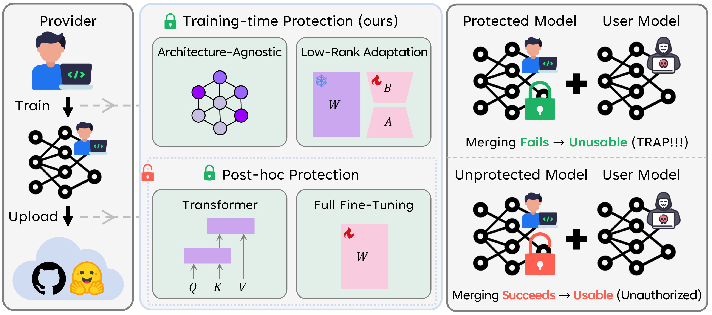
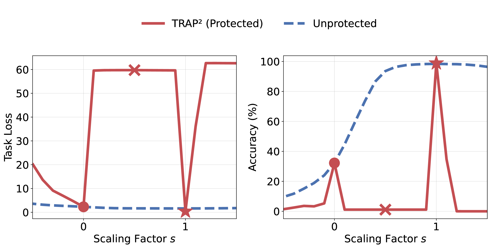

# Official Implementation of Trap² (ICML 2026)

This repository contains the official code implementation for the paper:

> **Making Models Unmergeable via Scaling-Sensitive Loss Landscape**
>
> Minwoo Jang, Hoyoung Kim, Jabin Koo, Jungseul Ok

🌐 **Project page:** https://pseudope.github.io/Trap2/

<p align="center">
  
</p>

## 🔍 Overview

Public model hubs make it easy to recombine released fine-tuned updates — both lightweight adapters (e.g., LoRA) and full checkpoints — into new models via **model merging**. However, this modularity creates a *governance gap*: downstream users can compose released weights into **unauthorized mixtures** that bypass safety alignment or licensing terms. Existing defenses are largely *post-hoc* and *architecture-specific* (tailored to Transformer symmetries and requiring full-weight access), so they transfer poorly to non-Transformer backbones and adapter-only releases.

We propose **Trap²**, an **architecture-agnostic, training-time** protection framework that encodes *unmergeability* directly into the released update. Trap² treats **weight re-scaling as a simple proxy for the merging process**. The protection is induced by shaping the **loss landscape along the scaling direction** during fine-tuning, rather than by a post-hoc transformation of the weights.

---

## ⚙️ Method at a Glance

<p align="center">
  
</p>

Trap² optimizes the released update `ΔW` to keep the nominal-scale loss low while *raising* the loss at off-nominal scales (Algorithm 1 in the paper):

```
minimize   J = L_nominal(ΔW)  −  λ · E_s[ w(s) · L_scaled(ΔW; s) ]
where      L_scaled(ΔW; s) = L(W₀ + s · ΔW),   s ~ Unif([s_min, 1−δ] ∪ [1+δ, s_max])
```

- `s` is the scaling factor; `s = 1` is the nominal (standalone) scale.
- The exclusion band `[1−δ, 1+δ]` keeps a margin around the nominal scale.
- `λ` trades off standalone utility against unmergeability; `w(·)` re-weights the off-nominal term across scales.

---

## 🚀 Getting Started

### Installation
```bash
git clone https://github.com/ml-postech/Trap2.git
cd Trap2
conda env create -f Trap2.yml
conda activate Trap2
```

### Checkpoints for Base Models

Pretrained backbone checkpoints are downloaded automatically from HuggingFace into `data/` (the `cachedir`) when the scripts run: OpenAI CLIP ViT-B/32 and ViT-L/14, the OpenCLIP ConvNeXt for vision classification experiments, and Llama-3.1-8B for the mathematical reasoning experiments. No manual download is required.

### Dataset Preparation

Our data splits and merging utilities are adapted from [KnOTS](https://github.com/gstoica27/KnOTS) (ICLR 2025; Stoica et al.) and [Core Space Merging](https://github.com/apanariello4/core-space-merging) (NeurIPS 2025; Panariello et al.). We thank their authors and the wider model-merging and PEFT communities for their open-source tools.

#### Vision Classification

**[Datasets]** All eight vision benchmarks live under `data/<dataset>` (paths are set in [`dataset/configs.py`](dataset/configs.py)). MNIST, SVHN, GTSRB, and FGVC-Aircraft are downloaded automatically via `torchvision`. Cars, DTD, EuroSAT, and RESISC require a one-time manual download — please follow the dataset instructions in [Representation Surgery](https://github.com/EnnengYang/RepresentationSurgery) (ICML 2024; Enneng et al.) or [Task Arithmetic](https://github.com/mlfoundations/task_vectors) (ICLR 2023; Ilharco et al.).

**[Train/val/test splits]** Split conventions are per-dataset. For Cars, GTSRB, MNIST, and SVHN, the validation set is a fixed `val_fraction` (e.g., 20%) carved out of the official test set using a **pre-computed shuffle index**. These `.pt` index files are taken from **KnOTS**, committed here under [`dataset/shuffled_idxs/`](dataset/shuffled_idxs), and referenced by the configs (`"shuffled_idxs": "dataset/shuffled_idxs/<dataset>_shuffled_idxs.pt"`), so the validation splits exactly match KnOTS and are reproducible. DTD uses the first of its 10 official splits (following TA), EuroSAT follows the Representation Surgery split, and RESISC / Aircraft use the official split as-is.

**[CLIP classification heads]** Zero-shot CLIP text heads (one per dataset) are precomputed and cached under `data/heads/<ARCH>/<dataset>_head.pt`, which the configs reference via `clip_encodings`. Generate them once per backbone (each run generates the heads for all eight datasets):

```bash
# ViT-B/32
python -m dataset.parsing.generate_clip_heads \
  --model openai/clip-vit-base-patch32 \
  --heads_dir data/heads/ViT-B-32-CLIP \
  --config 8vision_train

# ViT-L/14
python -m dataset.parsing.generate_clip_heads \
  --model openai/clip-vit-large-patch14 \
  --heads_dir data/heads/ViT-L-14-CLIP \
  --config 8vision_train_l14

# ConvNeXt (OpenCLIP)
python -m dataset.parsing.generate_openclip_heads \
  --model convnext_base_w --pretrained laion2b_s13b_b82k \
  --heads_dir data/heads/ConvNeXt-Base-OpenCLIP \
  --config 8vision_train_openclip_convnext
```

#### Mathematical Reasoning

Both GSM8K and ASDiv are downloaded automatically via the HuggingFace `datasets` library. Hence, no manual preparation is needed. For GSM8K, we use the official test split and hold out 10% of the training split for validation. ASDiv has no predefined splits, so it is partitioned into 70% / 15% / 15% (train / validation / test). Both partitions use a fixed seed, so the splits are reproducible.

---

## 🧪 Usage

**Trap² acts entirely at training time**: it shapes the released update during fine-tuning. Merging then serves as the **evaluation**: a downstream user merges the released updates, and we check that the protection degrades that merge while standalone utility is preserved. The workflow here is: **(1) train** the per-task updates — the target task with Trap² and the remaining tasks with the standard (unprotected) procedure, each a LoRA adapter or a fully fine-tuned model — then **(2) merge** them to evaluate the protection. Each training section below gives both the protected (Trap²) and the baseline (unprotected) command.

**Protection arguments** (mapping to Algorithm 1), shared by every training entry point below:

| Argument | Meaning |
|---|---|
| `--lambda_reg` | Trade-off weight `λ` between standalone utility and unmergeability |
| `--rand_alpha_min` / `--rand_alpha_max` | Scaling range `[s_min, s_max]` sampled during training |
| `--rand_alpha_weight` | Off-nominal re-weighting `w(·)` (e.g., `inv`) |

### Vision Classification

#### LoRA

Protected (Trap²):

```bash
python -m training_scripts.8vision_training_trap2 \
  --dataset mnist \
  --config 8vision_train \
  --lambda_reg 0.001
```

Baseline (unprotected):

```bash
python -m training_scripts.8vision_training \
  --dataset mnist \
  --config 8vision_train
```

#### Full Fine-Tuning

Protected (Trap²):

```bash
python -m training_scripts.8vision_training_full_trap2 \
  --dataset mnist \
  --config 8vision_train_full \
  --lambda_reg 0.005
```

Baseline (unprotected):

```bash
python -m training_scripts.8vision_training_full \
  --dataset mnist \
  --config 8vision_train_full
```

### Mathematical Reasoning

The same scaling-sensitive protection applies to autoregressive LLMs on mathematical-reasoning tasks. Supported tasks: `gsm8k`, `asdiv`.

> **Hugging Face access.** The LLM scripts download gated Llama checkpoints, so > export a token first: `export HUGGINGFACE_TOKEN=<your_hf_token>`.

Protected (Trap²):

```bash
python -m training_scripts.math_training_trap2 --task gsm8k
```

Baseline (unprotected):

```bash
python -m training_scripts.math_training --task gsm8k
```

### Merging

To verify protection, merge the released update together with third-party updates and measure the degradation of the merged model relative to merging an unprotected update of comparable standalone utility.

Vision — LoRA adapters:

```bash
python -m eval_scripts.8vision_pertask_linearsearch \
  --config vitB_r16_linearsearch_universal \
  --merge_method tsv \
  --merge_space core
```

Vision — fully fine-tuned models:

```bash
python -m eval_scripts.8vision_pertask_linearsearch_full \
  --config vitB_full_linearsearch_universal \
  --merge_method tv \
  --merge_space full
```

Mathematical reasoning adapters:

```bash
python -m eval_scripts.math_pertask_linearsearch \
  --config llama31_8b_math_r32_tv_trap2 \
  --merge_method tv \
  --merge_space full
```

Merging configs (in [`configs/`](configs)) list the base model and the adapter paths to merge; configs without a `_trap2` suffix are unprotected baselines and `_trap2` configs use Trap²-protected adapters (a name token like `_tv` denotes the default merge method — Task Arithmetic — and can be overridden with `--merge_method`). Protection is evaluated across a range of merge methods and spaces, so that unmergeability is shown to hold broadly rather than against a single merger:

* Merge methods:
  - `tv`: Task Arithmetic
  - `ties`: TRIM, ELECT SIGN & MERGE (TIES-Merging)
  - `dare-ties`: Drops And REscales (DARE) + TIES
  - `tsv`: Task Singular Vector (TSV)
  - `cart`: Centered Arithmetic with Rank-reduced Task Vectors (CART)

* Merge spaces:
  - `full`: Full Space merging
  - `knots`: KnOTS Space merging
  - `core`: Core Space merging

---

## ❓ FAQ

### Can I use data-dependent merging (RegMean, CoM) or data-driven recovery (ProDistill, SFT) with Trap²?

Yes. Because Trap² is purely a **training-time** technique, its output is an ordinary protected adapter (or checkpoint). Hence, you can feed the released updates to any external implementation as-is, even though such operators are **not vendored** in this repository.  For example, ProDistill (ICML 2025; Xu et al.) is available at its [official repository](https://github.com/JingXuTHU/Scalable_Model_Merging_with_Progressive_Layerwise_Distillation), and RegMean (ICLR 2023; Jin et al.) / Chain of Merges (arXiv; Buzzega et al.) can be reproduced from their original code. If you implement them yourself, please note that these operators must be applied in **full space** (i.e., on the materialized update `ΔW = BA`).

### Does Trap² require more work than post-hoc defenses (PaRaMS, Merge-Lock)? It seems to need both fine-tuning *and* a defense, whereas they apply only a defense.

This is **by far the most frequent question we've got**, so it is worth spelling out. The premise conflates two steps. A post-hoc defense cannot be applied in a vacuum — it presupposes a model that has **already been fine-tuned**. So post-hoc protection is in fact two steps: (1) fine-tune the task model, then (2) apply the function-preserving transform. The "defense only" impression simply omits the fine-tuning that has to happen first. Trap² instead folds the protection directly into the fine-tuning objective: you train once, and the resulting update is already protected. There is no separate defense step afterward. End to end, both approaches require training a task model; Trap² merely integrates the protection into that single training run rather than bolting on a second post-hoc stage.

---

## 📚 Citation

If you use this code in your research, please cite our paper:

```bibtex
@inproceedings{jang2026making,
  title={Making Models Unmergeable via Scaling-Sensitive Loss Landscape},
  author={Minwoo Jang and Hoyoung Kim and Jabin Koo and Jungseul Ok},
  booktitle={Proceedings of the 43rd International Conference on Machine Learning},
  year={2026}
}
```

---

## 📄 License

This project is released under the [MIT License](LICENSE). Parts of the merging code in [`task_merger.py`](task_merger.py) are adapted from [KnOTS](https://github.com/gstoica27/KnOTS) (MIT License, © 2024 George Stoica) and [Core Space Merging](https://github.com/apanariello4/core-space-merging) (Apache License 2.0); the original terms apply to those portions.